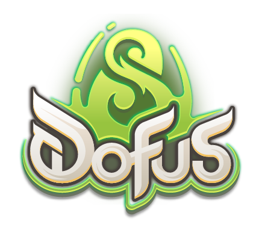

<p align="center">
    
</p>

<h1 align="center">
    Krosmoz Assets
    </br></br>
</h1>

## 📌 Description

This repository is exclusively for storing and organizing **Dofus Unity** game assets for the [Krosmoz](https://github.com/Krosmoz-Development/Krosmoz) project. It includes visual, audio, and other resources essential for the project's development.

---

## 📂 Content

| 📁 Folder       | 📜 Description |
|----------------|----------------------------------------------------------------|
| `Achievements/` | Achivement icons. |
| `Alignments/`  | Alignment icons. |
| `Breeds/`      | breed icons. |
| `Challenges/`  | Challenge icons. |
| `Flags/`       | Flags icons. |
| `Items/`       | Item icons. |
| `Monsters/`    | Monster icons. |
| `Spells/`      | Spell icons. |
| `Tactical/`    | Tactical map tiles. |

---

## 📥 Download & Usage

1. Clone the repository:

    ```sh
    git clone https://github.com/jimmy-mll/Krosmoz-Assets.git
    ```

2. Use the assets into your project:

    ```csharp
    new DiscordEmbedBuilder().WithImageUrl("https://github.com/Krosmoz-Development/Krosmoz-Assets/Monsters/{MonsterId}.png");
    ```

---

## ⚠️ Disclaimer

This repository contains only asset files and does not include any executable code. It is intended to facilitate the management of graphical and audio resources.

---

## 🤝 Contributing

If you would like to add or improve assets:

1. Fork the repository
2. Add/modify the files
3. Submit a pull request

Please follow the repository's structure and avoid adding unnecessary files.

---

## 📜 License

The assets in this repository are intended solely for study and development purposes within the Krosmoz project. Redistribution or commercial use is not allowed without the rights holders' consent.